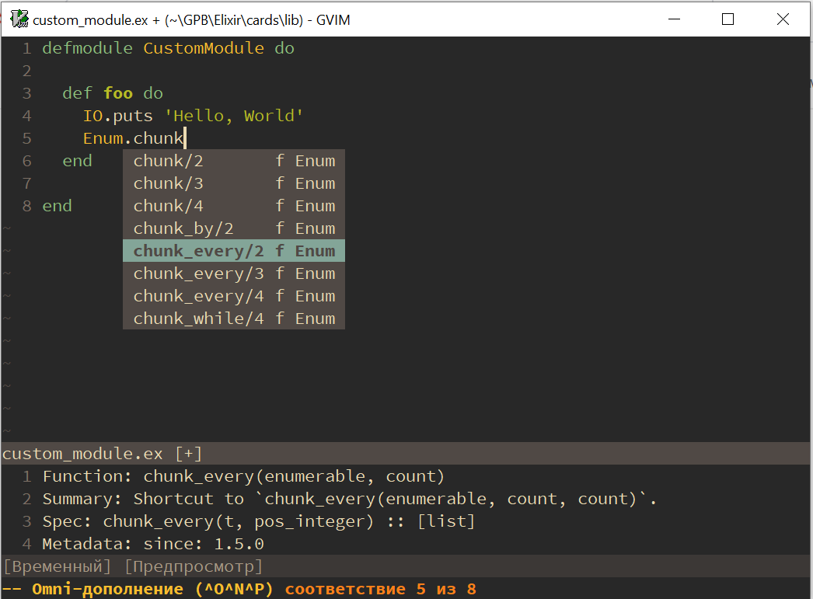

# moonshiner.vim
Vim plugin providing Elixir code completion.

[](https://www.eclipse.org/legal/epl-v10.html)


## Features:
 * Code completion for functions.
 * Windows platform support.

*Note: this plugin does not support Linux platform at the moment. Please refer to the issue [#3](https://github.com/viastakhov/moonshiner.vim/issues/3).*

## Installation
### Environment requirements
 * Erlang/OTP >= 21
 * Elixir >= 1.10.2

### Plugin manager
Add following plugins into .vimrc:
```viml
" Using vim-plug
Plug 'elixir-editors/vim-elixir'
Plug 'viastakhov/moonshiner.vim'
```
Install plugins and reload vim application.

## Usage
### Code completion
This plugin uses omni-completion feature, so that in order to call code completion you have to press following keys in *INSERT* mode:
```viml
<C-x>-<C-o>
```
<center></center>

## Credits
This plugin uses [ElixirSense](https://github.com/elixir-lsp/elixir_sense), an API/Server for Elixir projects that provides context-aware information for code completion, documentation, go/jump to definition, signature info and more.

## License
Copyright © 2020 Vladimir Astakhov [viastakhov@mail.ru]

Distributed under the Eclipse Public License 1.0.
